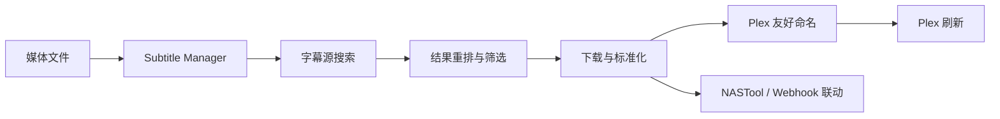

<div align="center">

# Subtitle Manager

**为 NAS、Plex 与媒体服务器设计的中文字幕自动化控制台**

[Docker Hub](https://hub.docker.com/r/alexwjxing/subtitle-manager) · [GitHub](https://github.com/alexing0805/subtitle-manager) · [快速开始](docs/quickstart.md) · [Docker Hub 文案](docs/docker-hub.md)

[](https://hub.docker.com/r/alexwjxing/subtitle-manager)
[](https://hub.docker.com/r/alexwjxing/subtitle-manager)
[](https://github.com/alexing0805/subtitle-manager/actions/workflows/ci.yml)
[](LICENSE)

</div>

> Subtitle Manager 不是一个“只会抓字幕的脚本”。它更像一个围绕 **字幕搜索、下载、标准化、Plex 刷新、NASTool 联动** 组织起来的完整工作台，适合长期挂在 NAS 或媒体服务器上跑。

## 你会得到什么

| 能力 | 说明 |
|------|------|
| 电影 / 电视剧 / 动漫 | 三类媒体统一管理，不需要拆成多套工具 |
| 多字幕源搜索 | 内置 `SubHD`、`Shooter`、`Assrt`、`OpenSubtitles` |
| 自动下载 | 扫描媒体目录，发现缺失字幕后自动处理 |
| 智能重排 | 结合文件名、NFO、TMDB、季集号做匹配排序 |
| Plex 友好输出 | 下载后自动整理为更适合 Plex 的外挂字幕命名 |
| NASTool 对接 | 支持 Webhook 触发字幕下载 |
| Web 管理界面 | 支持桌面与移动端浏览器访问 |

## 工作流一图看懂



## 为什么这个项目更适合长期跑在 NAS 上

- 它不只关心“能不能搜到字幕”，也关心 **结果质量**、**文件命名**、**Plex 是否能直接识别**。
- 它不只支持手动按钮，也支持 **自动扫描** 与 **Webhook 触发**，适合长期无人值守。
- 它不把所有配置都绑死在容器环境变量里，很多需要持久化的设置可以通过 Web 界面管理。

## 一分钟启动

### Docker Compose

```yaml
services:
  subtitle-manager:
    image: alexwjxing/subtitle-manager:latest
    container_name: subtitle-manager
    restart: unless-stopped
    ports:
      - "18080:8080"
    environment:
      MOVIE_DIR: "/movies"
      TV_DIR: "/tvshows"
      ANIME_DIR: "/anime"
      SUBTITLE_SOURCES: "shooter,assrt,opensubtitles,subhd"
      NASTOOL_ENABLED: "false"
    volumes:
      - /path/to/movies:/movies
      - /path/to/tvshows:/tvshows
      - /path/to/anime:/anime
      - ./logs:/app/logs
      - ./data:/app/data
```

启动后访问：

- Web UI: `http://your-server:18080`
- API Docs: `http://your-server:18080/docs`
- Health: `http://your-server:18080/health`

### Docker Run

```bash
docker run -d \
  --name subtitle-manager \
  --restart unless-stopped \
  -p 18080:8080 \
  -e MOVIE_DIR="/movies" \
  -e TV_DIR="/tvshows" \
  -e ANIME_DIR="/anime" \
  -e SUBTITLE_SOURCES="shooter,assrt,opensubtitles,subhd" \
  -v /path/to/movies:/movies \
  -v /path/to/tvshows:/tvshows \
  -v /path/to/anime:/anime \
  -v $(pwd)/logs:/app/logs \
  -v $(pwd)/data:/app/data \
  alexwjxing/subtitle-manager:latest
```

## 首次配置建议

1. 先确认媒体目录挂载正确。
2. 打开设置页，补上 `TMDB_API_KEY`，这样匹配质量会明显更稳。
3. 如果你用 Plex，再补 `PLEX_SERVER_URL`、`PLEX_TOKEN` 和路径映射。
4. 如果你用 NASTool，再开启 Webhook 与安全令牌。
5. 需要持久化的配置优先通过 Web 设置页保存，不建议长期写死在 `docker-compose.yml` 的 `environment` 中。

## 常用环境变量

| 变量名 | 说明 | 默认值 |
|--------|------|--------|
| `MOVIE_DIR` | 电影目录 | `/movies` |
| `TV_DIR` | 电视剧目录 | `/tvshows` |
| `ANIME_DIR` | 动漫目录 | `/anime` |
| `SUBTITLE_SOURCES` | 启用的字幕源 | `shooter,assrt,opensubtitles,subhd` |
| `SCAN_INTERVAL` | 扫描间隔（分钟） | `30` |
| `AUTO_DOWNLOAD` | 自动下载字幕 | `true` |
| `AUTO_DOWNLOAD_DELAY_MIN_SECONDS` | 自动请求最小延迟 | `6` |
| `AUTO_DOWNLOAD_DELAY_MAX_SECONDS` | 自动请求最大延迟 | `14` |
| `NASTOOL_ENABLED` | 启用 NASTool 对接 | `false` |
| `NASTOOL_WEBHOOK_TOKEN` | Webhook 安全令牌 | 空 |
| `TMDB_API_KEY` | TMDB API Key | 空 |
| `OPENSUBTITLES_API_KEY` | OpenSubtitles API Key | 空 |
| `PLEX_SERVER_URL` | Plex 地址 | 空 |
| `PLEX_TOKEN` | Plex Token | 空 |

## NASTool / Plex 集成

### NASTool Webhook

支持事件：

- `download.completed`
- `media.scraped`
- `subtitle.missing`
- `transfer.completed`

Webhook 地址：

```text
POST /api/webhook/nastool
```

如果启用了令牌验证：

```text
http://your-server:18080/api/webhook/nastool?token=your_token
```

### Plex 联动

- 下载后可自动刷新媒体项
- 支持路径映射
- 支持更适合 Plex 的外挂字幕命名格式

## 项目结构

```text
subtitle-manager/
├── backend/                 # FastAPI 后端与字幕处理逻辑
├── web/                     # Vue 3 前端
├── docs/                    # 补充文档
├── scripts/                 # 本地启动/部署辅助脚本
├── Dockerfile
├── docker-compose.yml
├── docker-compose.nas.yml
├── docker-compose.unraid.yml
├── requirements.txt
└── .env.example
```

## 文档导航

- [快速开始](docs/quickstart.md)
- [NAS 部署](docs/nas-setup.md)
- [Docker Hub 页面](https://hub.docker.com/r/alexwjxing/subtitle-manager)
- [Docker Hub 发布文案](docs/docker-hub.md)
- [发布检查清单](docs/release-checklist.md)
- [GitHub 发布建议](docs/github-publish.md)
- [贡献指南](CONTRIBUTING.md)
- [安全说明](SECURITY.md)
- [项目记忆文档（历史参考，可能滞后）](docs/project-memory.md)

## 开发与验证

```bash
# 后端语法检查
python -m py_compile backend/api_server.py backend/subtitle_manager.py

# 前端构建
cd web && npm run build

# Docker 构建
cd .. && docker build -t subtitle-manager:latest .
```

## 许可证

本项目当前使用 [MIT License](LICENSE)。

## 最后说明

- 本项目聚焦 **中文字幕下载与管理**，不负责完整媒体刮削流程。
- 某些字幕源可能会出现验证码、限流或站点波动。
- 图片字幕（如 `SUP`）体积通常明显大于文本字幕。
- 请尊重字幕作者与字幕站点的使用规则。
